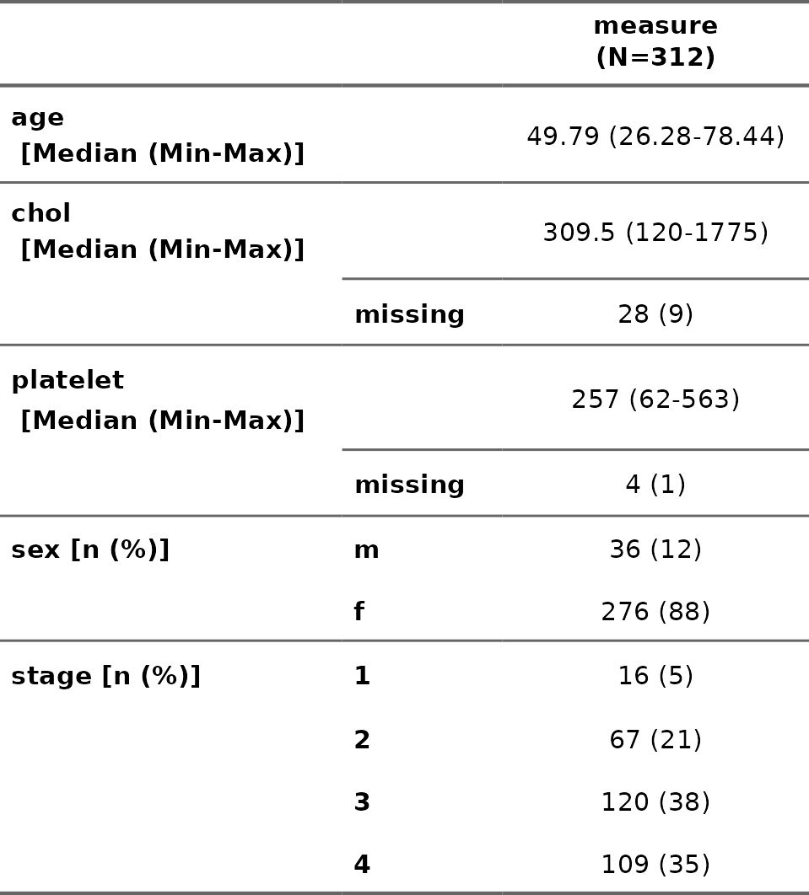
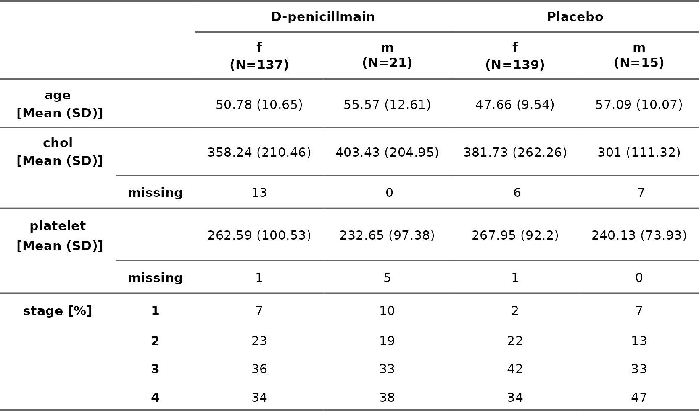

<!-- README.md is generated from README.Rmd. Please edit that file -->

# flexTab1

<!-- badges: start -->
<!-- badges: end -->

# Overview

The goal of flexTab1 is to create a highly flexible Table 1 for
descriptive statistics, allowing users to customize the output format,
choose appropriate summary measures, and optionally display missing
values, p-values (testing for difference between two groups), and
standardized mean differences (SMD). It is designed to adapt to various
reporting needs and ensures comprehensive data summaries in a
user-friendly format.

Following costumations are available:

This package is still an experimental version.

## Installation

You can install the development version of flexTab1 from
[GitHub](https://github.com/KGutmair/flexTab1)

``` r
# install.packages("devtools")
devtools::install_github("KGutmair/flexTab1")
```

## Example

# Table 1 for one group/treatment arm

``` r
library(dplyr)
library(flexTab1)
library(flextable)


# Load pbc data from the survival package
pbc <- survival::pbc

baseline_var <- c("age", "chol", "sex", "stage", "platelet")

pbc <- pbc %>%
     mutate_at(c("stage", "trt", "edema", "hepato"), function(x) as.factor(x)) %>%
     filter(!is.na(trt)) %>%
     mutate(trt = ifelse(trt == "1", "D-penicillmain", "Placebo"))

 tab1_ex <- Table1_flex(
     data = pbc,
     variables = baseline_var 
   )

tab1_ex %>%
  fontsize(size = 11, part = "all") %>%
   line_spacing(space = 1.7, part = "all") %>%
   autofit() 
```



# Table 1 for two treatment arms

``` r
tab1_ex <- Table1_flex(
  data = pbc,
  variables = baseline_var,
  group_var = "trt",
  add_measure_ident = TRUE,
  display_pvalue = TRUE, 
  sort_rows = c("age", "sex", "stage", "chol", "platelet"),
  measures_cat = c("absolute", "relative"),
  measures_num = c("median", "min", "max")
)

tab1_ex %>%
   line_spacing(space = 1.7, part = "all") %>%
   autofit() 
```


# Table 1 for nested groups

The Table1_flex also supports a nested group structure, meaning having
subgroups within superior groups

``` r
# The Table1_flex also supports a nested group structure, meaning having subgroups within
# superior groups
baseline_var <- c("age", "chol", "platelet", "stage")
tab1_ex <- Table1_flex(
  data = pbc,
  variables = baseline_var,
  group_var = "sex",
  treatment_arm = "trt",
  add_measure_ident = TRUE,
  sort_rows = c("age", "stage", "chol", "platelet"),
  measures_cat = c("relative"),
  measures_num = c("mean","sd"),
  flextable_output = TRUE
)
flextable::autofit(tab1_ex)
```


