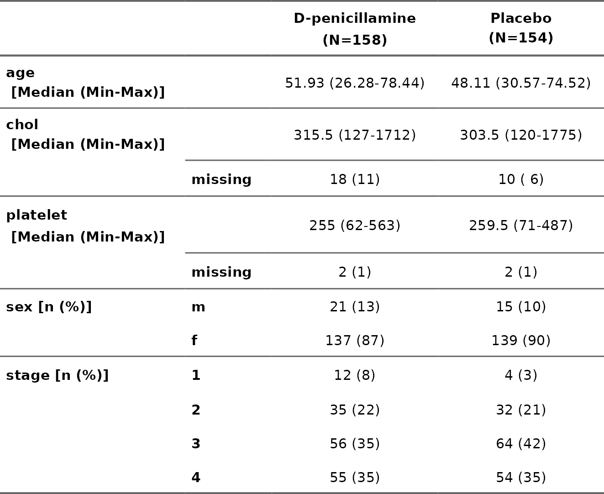
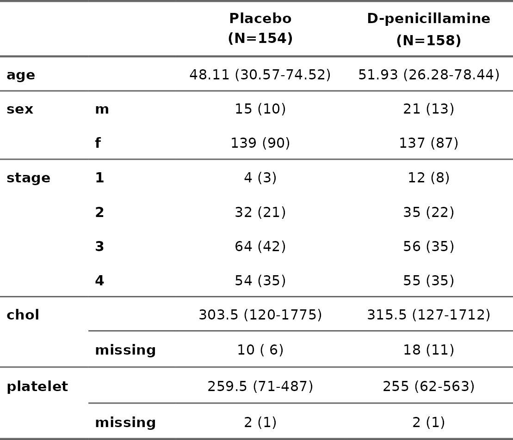
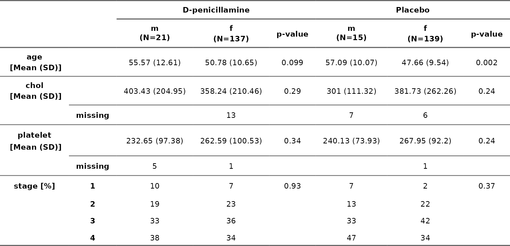

<!-- README.md is generated from README.Rmd. Please edit that file -->

# flexTab1

<!-- badges: start -->

[](https://github.com/KGutmair/flexTab1/actions/workflows/R-CMD-check.yaml)
[](https://app.codecov.io/gh/KGutmair/flexTab1)
<!-- badges: end -->

## Overview

This function creates a highly flexible summary measure table for
descriptive statistics (“Table 1”) with options to customize both the
statistical options and the output layout. It supports:

- **Statistical Flexibility**: Various summary measures can be selected
  for categorical (*absolute*, *relative*) and numerical variables
  (*mean*, *median*, *sd*, *min*, *max*, *quartile1*, *quartile3*),
  arranged in any combination. *Missing values* frequencies for each
  variable can be optionally displayed. For group comparisons, options
  include displaying *p-values* and *standardized mean differences*
  (SMD).

- **Custom Layout**:The following layout options are available: *row
  sorting* and *column sorting*, the option to display *summary measure
  units* (e.g., n (%), median (SD)), and an empty line after each
  variable for improved readability. The output can be generated as
  either a *publication-ready* output table (created with the
  `flextable` package) or as a `"data.frame"`, allowing for further
  modifications or integration with other table formatting packages.

- **Group Analysis**: Supports summary measured for a *single group* and
  stratified by *two or more groups*.Additionally, a nested group
  structure is supported, allowing for the comparison of subgroups
  within main groups.

## Installation

You can install the development version of flexTab1 from
[GitHub](https://github.com/KGutmair/flexTab1)

``` r
# install.packages("devtools")
devtools::install_github("KGutmair/flexTab1")
```

## Usage

### Loading data + preparation

``` r
library(dplyr)
library(flexTab1)
library(flextable)


# Load pbc data from the survival package
 pbc <- survival::pbc

   baseline_var <- c("age", "chol", "sex", "stage", "platelet")

   pbc[c("stage", "trt", "edema", "hepato")] <-
     lapply(pbc[c("stage", "trt", "edema", "hepato")], as.factor)

   pbc <- pbc[!is.na(pbc$trt), ]
 pbc$trt <- ifelse(pbc$trt == "1",
 "D-penicillamine",
 "Placebo")
```

### Table 1 for one group/treatment arm

``` r

tab1_example <- Table1_flex(
     data = pbc,
     variables = baseline_var,
     measures_num = c("mean", "sd"),
     measures_cat = c("absolute", "relative")
   )

tab1_example %>%
   line_spacing(space = 1.7, part = "all") %>%
   autofit() 
```


### Table 1 for two treatment arms

``` r
tab1_example <- Table1_flex(
  data = pbc,
  variables = baseline_var,
  group_var = "trt")


tab1_example %>%
   line_spacing(space = 1.7, part = "all") %>%
   autofit() 
```



``` r
tab1_example <- Table1_flex(
  data = pbc,
  variables = baseline_var,
  group_var = "trt",
  add_measure_ident = FALSE,
  display_pvalue = TRUE, 
  display_smd = TRUE,
  sort_rows = c("age", "sex", "stage", "chol", "platelet"),
  measures_cat = c("absolute", "relative"),
  measures_num = c("median", "min", "max"),
  group_order = c("Placebo", "D-penicillamine")
)

tab1_example %>%
   line_spacing(space = 1.7, part = "all") %>%
   autofit() 
```



### Table 1 for nested groups

The Table1_flex also supports a nested group structure, meaning having
subgroups within main groups

``` r

baseline_var <- c("age", "chol", "platelet", "stage")
tab1_example <- Table1_flex(
  data = pbc,
  variables = baseline_var,
  group_var = "sex",
  treatment_arm = "trt",
  add_measure_ident = TRUE,
  display_pvalue = TRUE,
  measures_cat = c("relative"),
  measures_num = c("mean","sd"),
  flextable_output = TRUE
)

tab1_example %>%
   line_spacing(space = 1.7, part = "all") %>%
   autofit() 
```


